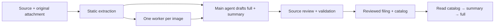

# Knowledge Base Kit

**Turn documents into a local, source-backed Markdown knowledge base with Claude
Code or Codex.** Keep the original attachment, a detailed `full.md`, a practical
`summary.md`, and a catalog that agents can read before opening larger files.

[简体中文](README.zh-CN.md) · [Install](docs/installation.md) · [Examples](examples/README.md) · [Limitations](docs/limitations.md)


## What you get

- Project-local `process_docs` and `kb` skills, shared by both agents.
- Extraction helpers for PDFs, DOCX, static HTML, notebooks, text and images.
- One image per isolated worker session, explicit backend selection, bounded
  retries and provenance-aware caches.
- Structure, link, archive-folding and TeX checks before filing.
- A separate knowledge workspace: your documents stay outside this toolkit repo.

This is an **agent-assisted workflow**, not a hosted service or an automatic
one-command ingestion engine. The main agent writes and reviews the full text and
summary; scripts handle extraction, image workers and checks. Validators cannot
prove factual accuracy or perfect coverage.

## Quick start

You need Python 3.10+, Node.js 20+, Pandoc 3+, and an authenticated Claude Code or
Codex CLI for model-assisted processing. Start from a downloaded or cloned copy
of this repository. Tested versions and platform limits are in
[compatibility](docs/compatibility.md).

```sh
cd knowledge-base-kit
python3 -m venv .venv
source .venv/bin/activate
python -m pip install -r requirements.txt
python scripts/init_workspace.py ../my-kb --backend codex --with-example
cd ../my-kb
python kb.py check --backend codex
```

Use `--backend claude` or `--backend both` when initializing for those agents.
Add `--language zh-CN` for Chinese summaries. The installer copies skills and uses
relative project-local links; it does not edit global agent settings or another
knowledge base. It refuses an unrelated nonempty destination.

Open `my-kb` in your chosen agent and ask:

> Use the local process_docs skill with the Codex backend to process
> inbox/quickstart.md. Prepare the full document and summary, show me the proposed
> category and changed files, and wait for my review before filing.

For a first look **without an account or model calls**, run this from the toolkit
folder after installing dependencies and Node/Pandoc:

```sh
python scripts/offline_demo.py ../kb-demo
```

The offline demo extracts the included Markdown, copies a reviewed reference
output and validates it in a fresh workspace. It does not simulate AI generation.
See the [reference full document](examples/expected-output/quickstart/full.md)
and [summary](examples/expected-output/quickstart/summary.md).

## How it works



Your workspace contains `inbox/`, `catalog.md`, knowledge categories and a private
`.kbkit/` installation. A document has `full.md`, `summary.md` and its original
attachment. A category has `README.md`. [Architecture](docs/architecture.md)
explains the boundaries; [workflows](docs/workflows.md) gives the exact steps.

## Configuration and privacy

Edit the workspace's `kb.config.yaml`. Models default to the selected CLI's
default; use a vision-capable model supported by your account. Authentication is
handled by the CLI. This repository contains no provider credentials.

Image workers send images and a short source context to the selected provider.
Text drafting in your main agent also follows that provider's data handling.
“Local knowledge base” describes where files live; it does not mean local-only
inference. Never commit your private workspace or logs to this toolkit repository.
Read [configuration](docs/configuration.md) and [security](SECURITY.md).

## Development

```sh
python -m pip install -r requirements-dev.txt
python -m unittest discover -s tests -v
python scripts/validate_release.py
```

Tests are offline and use fake CLI processes. GitHub Actions runs the same checks
without model credentials. See [contributing](CONTRIBUTING.md),
[maintenance](docs/maintaining.md) and [publishing](docs/publishing.md).

## License

[AGPL-3.0-only](LICENSE) for original project code and documentation. PyMuPDF and
html2text are GPL-family dependencies; KaTeX is bundled under MIT with its notice.
See [third-party notices](THIRD_PARTY_NOTICES.md). This software license does not
automatically license your source documents or knowledge content.
