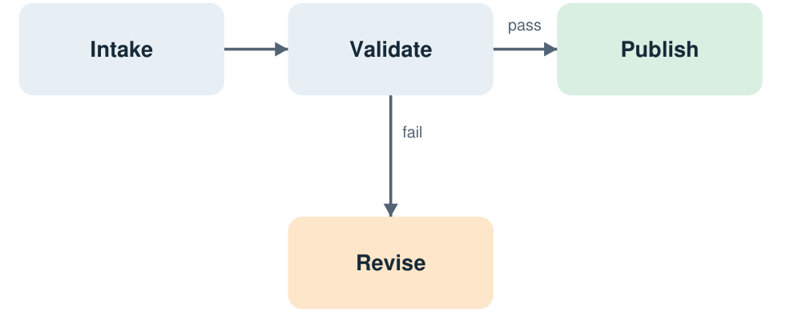

# A small document, fully traceable

This self-authored source contains invented measurements for testing only.

## Table of Contents

- [Measurements](#measurements)
- [Check the sum](#check-the-sum)
- [A reviewable workflow](#a-reviewable-workflow)
- [Raw text archive](#raw-text-archive)
- [Related Documents](#related-documents)

## Measurements

Two samples are combined. Preserve every value and its unit. The measurements
below are invented for this example.

| Sample | Volume (L) |
| --- | --- |
| Alpha | 1.25 |
| Beta | 0.75 |
| **Total** | **2.00** |

The source uses thin table borders, pale blue-gray header/Beta rows and a bold
Total row. These are presentation choices; the values and units carry the result.

## Check the sum

$$V_{\mathrm{total}} = V_{\mathrm{Alpha}} + V_{\mathrm{Beta}} = 1.25 + 0.75 = 2.00\,\mathrm{L}$$

The source prints variable names with literal underscores; the expression above
uses TeX subscripts without changing the calculation.

Keep decimal precision. A zero value must remain visible. Control sample:
0.00 L. Do not treat zero as a missing cell.

## A reviewable workflow

Read each arrow and both outcomes before writing a description.



Intake leads right to Validate. From Validate, the rightward arrow labeled
“pass” leads to the green Publish node; the downward arrow labeled “fail” leads
to the orange Revise node. Intake and Validate have blue-gray backgrounds.
The arrows and branch labels are gray. All four nodes are rounded rectangles.

After revision, request a fresh check; do not imply automatic approval. The diagram
has no outgoing arrow from Revise. Both pages carry the heading
“KNOWLEDGE BASE KIT / SELF-AUTHORED EXAMPLE” and footer “Fictional measurements for
testing only”; page numbers are 1 and 2.

## Raw text archive

The following is the extractor's unmodified text, including its table repetition.

<details>
<summary>Raw source text (verbatim archive)</summary>

```text

--- Page 1 ---

A small document, fully traceable
KNOWLEDGE BASE KIT / SELF-AUTHORED EXAMPLE
Fictional measurements for testing only
1
Two samples are combined. Preserve every value and its unit.
The measurements below are invented for this example.
1. Measurements
Sample
Volume (L)
Alpha
1.25
Beta
0.75
Total
2.00
2. Check the sum
V_total = V_Alpha + V_Beta = 1.25 + 0.75 = 2.00 L
Keep decimal precision. A zero value must remain visible.
Control sample: 0.00 L. Do not treat zero as a missing cell.

[Table]
Sample | Volume (L)
Alpha | 1.25
Beta | 0.75
Total | 2.00


--- Page 2 ---

A reviewable workflow
KNOWLEDGE BASE KIT / SELF-AUTHORED EXAMPLE
Fictional measurements for testing only
2
Read each arrow and both outcomes before writing a description.
Intake
Validate
Publish
Revise
pass
fail
Intake leads to Validate.
A passing check leads to Publish (green).
A failed check leads to Revise (orange).
After revision, request a fresh check; do not imply automatic approval.
```

</details>

## Related Documents

No related documents yet.
